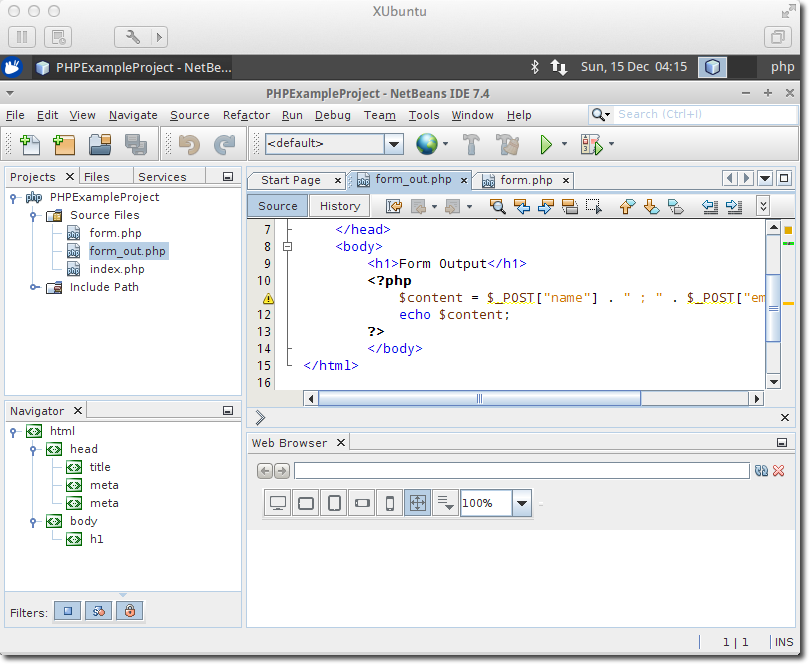

# PHP-Debugging-VM

## Introduction 

The PHP-Debugging-VM is a Linux based virtual machine for VMware, which enables you to debug and run PHP based web pages and applications.

**So why did I set this thing up?**

Once in a while I am using PHP to do some stuff for one of my [homepages](/websites.html). Usually its very painfull, since most of the times I don't have a running webserver on my local machine. Just makes no sense to have a webserver running all the times.

So I ended up using a simple text editor and upload the files to my webserver for testing. Of course without debugger thats a very painfull and slow process. So I created that VM and published it here with the hope it might be useful for other.

If you have questions or suggestions for improvement feel free to contact me.

## Features and installed software

- Xubuntu based virtual machine for VMware
- Netbeans, Apache, PHP 5, Debugger for PHP
- MySQL, phpMyAdmin
- Git, Subversion

## Download

[Download](http://storage.ekiwi.de/phpvm/XUbuntu.7z) - ca. 2 GB

### User / Login

These are the initial credentials for login:

- Username: php
- Password: php

Start Firefox for more information and help.

## Screenshots

